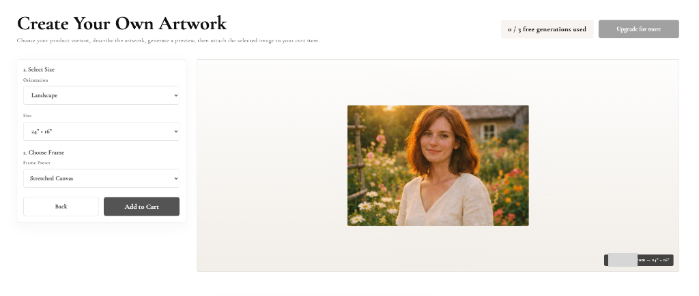
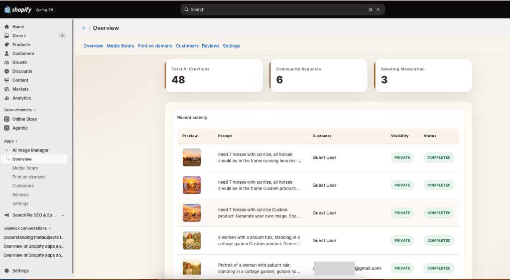
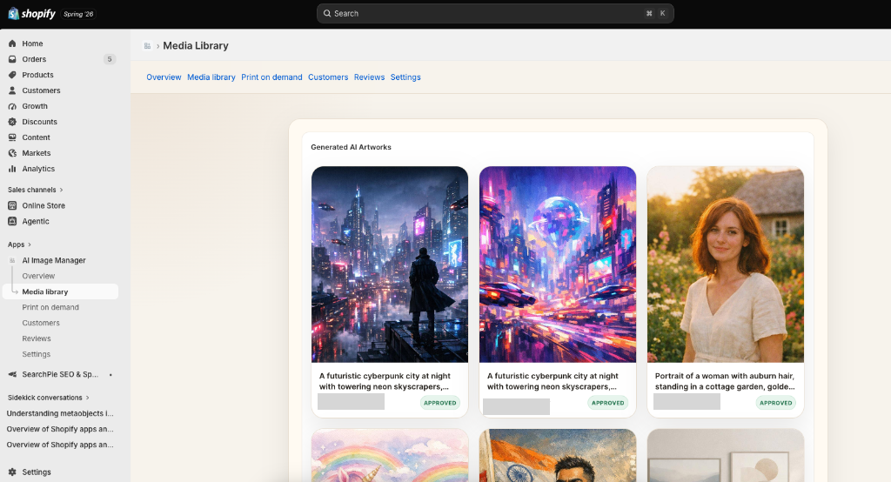
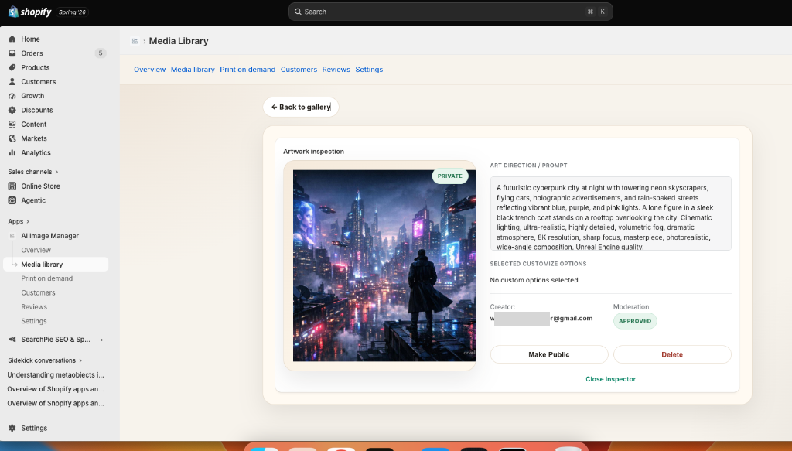
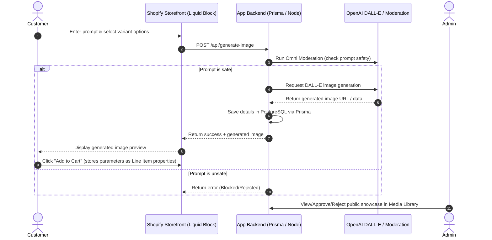

# AI Image Manager for Shopify

Shopify app for AI product-image generation, public galleries, customer history, moderation, and admin management.

## 📸 System Walkthrough & Screenshots

Below is the user flow and administration system of the Shopify AI Product Image Generator.

### 1. Storefront Product Customization (Customer View)
Customers can customize their product variant dimensions, orientation, and frame selection, and then generate their custom AI artwork using embedded blocks in the storefront theme editor.


### 2. Admin Overview & Activity (Shopify Admin View)
The admin overview provides high-level analytics, including **Total AI Creations**, **Community Requests** (awaiting approval), and **Awaiting Moderation** queues, alongside a real-time recent activity logs feed.


### 3. Media Library Management
The Media Library lists all generated AI artworks. Admins can view approval/moderation statuses (e.g., `APPROVED`, `PRIVATE`) and manage public gallery submissions.


### 4. Artwork Inspection & Moderation
Admins can drill down into any artwork to inspect the detailed generation prompts, creator details, moderation status, and trigger actions (like `Make Public` or `Delete`).


---

## ⚙️ System Flow & Architecture

The following diagram illustrates how the system operates under the hood:



---

## 🛠️ Technology Stack Used

This application is built with modern Shopify app standards:
- **Core App Framework**: Shopify App Template using Remix / Vite & React.
- **Frontend Block (Storefront)**: Shopify Theme App Extensions (Liquid, HTML, CSS, JavaScript).
- **Database & Model Layer**: Prisma ORM with a PostgreSQL schema.
- **AI Engine**: OpenAI API (for image generation and safety moderation filtering).
- **Deployment & Containers**: Docker and Docker Compose (supporting VPS multi-container setups).
- **Task Automation**: GitHub Actions (CI/CD Deployment and Repository Syncing).

---

## 🚀 Setup & Installation Instructions

Follow this sequence to set up the repository locally. Run one command at a time and wait for each to complete:

```bash
# 1. Install and start PostgreSQL (e.g., macOS Homebrew)
brew install postgresql@16
brew services start postgresql@16
pg_isready

# 2. Create local database
createdb ai_image_manager

# 3. Install project dependencies
npm install

# 4. Generate Prisma Client and run migrations
npm run prisma -- generate
npm run prisma -- migrate dev --name ai_image_manager_schema

# 5. Link configuration to Shopify Partners
npm run config:link

# 6. Start the local Shopify development server
shopify app dev
```

### Environment Variables (.env)
Create a `.env` file in the root folder with the following configuration:
```bash
SHOPIFY_API_KEY=your_shopify_api_key
SHOPIFY_API_SECRET=your_shopify_api_secret
SHOPIFY_APP_URL=https://your-tunnel-url.ngrok-free.app
SCOPES=write_products,read_products,write_files,read_files,read_customers,write_customers
DATABASE_URL=postgresql://apple@localhost:5432/ai_image_manager?schema=public
OPENAI_API_KEY=your_openai_api_key
OPENAI_IMAGE_MODEL=gpt-image-1.5
OPENAI_MODERATION_MODEL=omni-moderation-latest
IMAGE_GENERATION_MODE=test # Set to 'live' for real OpenAI charges
TEST_IMAGE_URL=https://dummyimage.com/1024x1024/7d7355/ffffff.png&text=Generated+AI+Image
```

---

## 🗒️ Features Detail

- **Shopify React Router app shell**.
- **GPT Image 1 generation API** at `/api/generate-image`.
- **OpenAI prompt moderation** before image generation.
- **Prisma data model** for PostgreSQL tracking prompt history, visibility status, usage logs, and customer feedback.
- **Admin App Pages**:
  - `/app` overview
  - `/app/gallery` public image gallery
  - `/app/dashboard` customer image counts and activity
  - `/app/admin` moderation and visibility controls
- **Theme App Extension blocks**:
  - `AI product image studio`
  - `AI community gallery`
  - `AI profile images`
  - `AI image reviews`
- **Line Item Property checkout integration** dynamically linking generated artwork images directly to Shopify checkout cart items.
