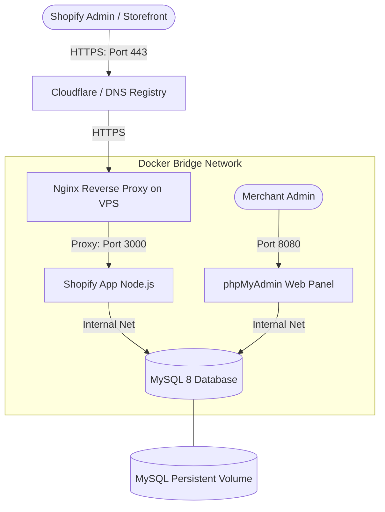

# Shopify AI Image Manager - VPS Docker Deployment & Shopify Live Integration Guide

This comprehensive guide explains how to host your custom Shopify App (**AI Image Manager**) on **Hostinger VPS** using **Docker**, **MySQL**, and **phpMyAdmin**, and how to integrate it on your live Shopify store: **`https://admin.shopify.com/store/orvella-70/`** (store handle: `orvella-70`).

This deployment is fully customized for your custom subdomain: **`shopify-ai.deploymeta.com`**.

---

## Architecture Overview

Your application is isolated and secured using Docker containers connected via an internal network. Only Nginx and phpMyAdmin (optional) expose external ports.



---

## Part 1: Retrieve Shopify Client Credentials & Configure App URLs

Before configuring your VPS, you need to grab your Shopify app credentials and configure the authorization URLs:

1. Go to the **Shopify Partner Dashboard**: [https://partners.shopify.com](https://partners.shopify.com).
2. Click **Apps** in the left navigation sidebar.
3. Click on your custom app **AI Image Manager**.
4. Retrieve Client Credentials:
   * Click on **Client credentials** in the left sidebar menu.
   * Under **Client credentials**, locate and copy:
     * **Client ID** (corresponds to `SHOPIFY_API_KEY`).
     * **Client Secret** (Click **Reveal client secret** and copy it; corresponds to `SHOPIFY_API_SECRET`).
5. **Configure Redirect URLs**:
   * Click on **Configuration** in the left menu.
   * Locate the **App URLs** card and update them:
     * **App URL**: `https://shopify-ai.deploymeta.com`
     * **Allowed redirection URLs**: `https://shopify-ai.deploymeta.com/auth/callback`
   * Locate the **App Proxy** card (near the bottom) and set:
     * **Proxy URL**: `https://shopify-ai.deploymeta.com/api`
     * **Subpath**: `ai-image`
     * **Prefix**: `apps`
   * Click **Save** in the top right corner.

---

## Part 2: Connect and Configure Hostinger VPS

### Step 1: Point Subdomain to VPS IP
Log in to your domain registrar (e.g., Hostinger DNS management or Cloudflare). Create an **A Record** pointing to your VPS:
* **Type**: `A`
* **Name**: `shopify-ai`
* **Content/Value**: `<YOUR_VPS_IP>` (e.g., `187.127.145.3`)
* **TTL**: `Auto` / `14400`
* **Proxy Status** (If on Cloudflare): Set to **DNS Only** (Grey Cloud) during Let's Encrypt certificate acquisition, then switch to **Proxied** (Orange Cloud) for security if desired.

### Step 2: Connect to your VPS via SSH
Open your terminal (on Mac) and run:
```bash
ssh root@<YOUR_VPS_IP>
```
*(Enter your root password when prompted).*

### Step 3: Install Docker and Docker Compose
Execute the following commands to install Docker Engine on Ubuntu (standard Hostinger OS):
```bash
# Update local packages
sudo apt update && sudo apt upgrade -y

# Install prerequisite system packages
sudo apt install apt-transport-https ca-certificates curl software-properties-common -y

# Add Docker's official GPG key
curl -fsSL https://download.docker.com/linux/ubuntu/gpg | sudo gpg --dearmor -o /usr/share/keyrings/docker-archive-keyring.gpg

# Set up the Docker stable repository
echo "deb [arch=$(dpkg --print-architecture) signed-by=/usr/share/keyrings/docker-archive-keyring.gpg] https://download.docker.com/linux/ubuntu $(lsb_release -cs) stable" | sudo tee /etc/apt/sources.list.d/docker.list > /dev/null

# Install Docker Engine and the Compose Plugin
sudo apt update
sudo apt install docker-ce docker-ce-cli containerd.io docker-compose-plugin -y

# Confirm installations
docker --version
docker compose version
```

### Step 4: Clone the Code and Setup Environment Variables
1. Create a working directory and clone your repository:
   ```bash
   git clone <YOUR_GIT_REPOSITORY_URL> /var/www/ai-image-manager
   cd /var/www/ai-image-manager
   ```
2. Create your production environment file:
   ```bash
   nano .env
   ```
3. Paste the following configuration, replacing the values with your actual keys and secrets:
   ```env
   PORT=3000
   NODE_ENV=production
   
   # MySQL configurations
   MYSQL_DB=ai_image_manager
   MYSQL_ROOT_PASSWORD=your_highly_secure_db_password_here
   
   # Shopify Credentials (Retrieved in Part 1)
   SHOPIFY_API_KEY="357dc9e36b9244048bc2c30f30992da2"
   SHOPIFY_API_SECRET="your_shopify_client_secret_here"
   SCOPES="read_products,write_products,read_customers,read_files,write_files,read_app_proxy,write_app_proxy"
   
   # External AI Services Configuration
   OPENAI_API_KEY="your_openai_api_key_here"
   IMAGE_GENERATION_MODE=live
   
   # Production Domain Routing
   APP_URL="https://shopify-ai.deploymeta.com"
   ```
   *Press `CTRL + O`, then `Enter` to save, and `CTRL + X` to exit.*

---

## Part 3: Build and Run Your Containers

Launch the multi-container stack. This runs the Node app, a MySQL 8 server, and phpMyAdmin in background daemon mode:
```bash
docker compose up -d --build
```

### What this does automatically:
1. **Pulls MySQL 8 image** and boots up the database.
2. **Performs Health Checks** on the database container to ensure it is accepting connections before starting other services.
3. **Runs `prisma db push`** inside your Node container, syncing your exact tables and indexes directly into MySQL.
4. **Builds the Shopify App production server** and binds it to port `3000`.
5. **Starts phpMyAdmin** on port `8080`.

To monitor status or review initialization logs:
```bash
docker compose ps
docker compose logs -f web
```

---

## Part 4: Setup Nginx Reverse Proxy & SSL (HTTPS)

Shopify requires that all applications run strictly over HTTPS. We will use Nginx on the host VPS to handle incoming traffic on `shopify-ai.deploymeta.com`, encrypt it using SSL certificates, and proxy it to our Dockerized app.

### Step 1: Install Nginx & Certbot
```bash
sudo apt install nginx certbot python3-certbot-nginx -y
```

### Step 2: Configure Nginx Routing
Create a custom Nginx configuration file:
```bash
sudo nano /etc/nginx/sites-available/shopify-app
```
Paste this configuration block:
```nginx
server {
    listen 80;
    server_name shopify-ai.deploymeta.com;

    location / {
        proxy_pass http://localhost:3000;
        proxy_http_version 1.1;
        proxy_set_header Upgrade $http_upgrade;
        proxy_set_header Connection 'upgrade';
        proxy_set_header Host $host;
        proxy_cache_bypass $http_upgrade;
        proxy_set_header X-Forwarded-For $proxy_add_x_forwarded_for;
        proxy_set_header X-Forwarded-Proto $scheme;
    }
}
```
*Save and exit (`CTRL + O`, `Enter`, `CTRL + X`).*

### Step 3: Enable the Route and Restart Nginx
```bash
sudo ln -s /etc/nginx/sites-available/shopify-app /etc/nginx/sites-enabled/
sudo rm -f /etc/nginx/sites-enabled/default
sudo nginx -t
sudo systemctl restart nginx
```

### Step 4: Obtain Let's Encrypt SSL
```bash
sudo certbot --nginx -d shopify-ai.deploymeta.com
```
*Follow the prompts (enter your email, agree to the terms). Certbot will automatically install the certificate, bind it to Nginx, and configure permanent redirection to HTTPS.*

---

## Part 5: Managing Your Database with phpMyAdmin

You can graphically browse and modify all your databases, tables, and credentials through **phpMyAdmin**:

1. Open your browser and navigate to:
   `http://<YOUR_VPS_IP>:8080`
2. Log in using these credentials:
   * **Server**: `db`
   * **Username**: `root`
   * **Password**: `<YOUR_MYSQL_ROOT_PASSWORD>`
3. Once logged in, select `ai_image_manager` in the left menu to view tables such as:
   * `Session` (Tracks oauth shop credentials)
   * `AiImageGeneration` (AI generation logs)
   * `CreditLedger` (Credits management)
   * `CustomerAccount` (Storefront accounts)

---

## Part 6: Integrating & Deploying Your App on Shopify Live Store

With your servers running and secure, configure the app elements in Shopify:

### Step 1: Deploy Theme App Extensions
Back on your **local computer terminal** (inside `/Users/apple/Downloads/ai-image-manager`), build and push the visual storefront widgets (e.g., AI Image Generator blocks) to Shopify:
```bash
npm run deploy
```
*(Select the active Shopify Partner profile, and follow the CLI prompt to register the extension).*

### Step 2: Install App on Your Store
1. Open your **Shopify Partner Dashboard** > **Apps** > **AI Image Manager**.
2. Click **Select store** or click **Install app** directly in the top right.
3. Select your live store: **`orvella-70`**.
4. You will be redirected to your live admin page `https://admin.shopify.com/store/orvella-70/` showing the install consent form.
5. Click **Install App** to complete authorization. The app dashboard will load inside your Shopify admin portal!

### Step 3: Place & Activate the Theme Blocks
1. Open your Shopify Store Admin dashboard: [https://admin.shopify.com/store/orvella-70/](https://admin.shopify.com/store/orvella-70/).
2. Navigate to **Online Store** > **Themes**.
3. Next to your active theme, click **Customize**.
4. Choose the template page where you want to embed the AI Generator (e.g., **Products** > **Default Product**).
5. In the left panel, click **Add block** under the product information panel.
6. Under **Apps**, select your custom block **AI Image Generator**.
7. Drag it to your preferred position (e.g. right below the "Buy Buttons").
8. Click **Save** in the top right corner.

Your AI Image Manager app is now **completely live, self-hosted on your Hostinger VPS, backed by a persistent MySQL DB, and fully interactive** for customers visiting your store!
